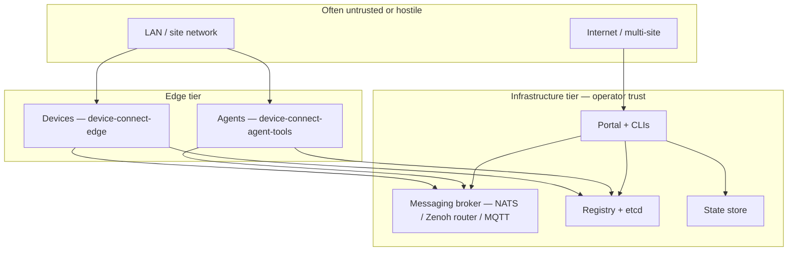

# Security Policy

## Reporting a Vulnerability

If you discover a security vulnerability in Device Connect, please report it responsibly. **Do not open a public GitHub issue.**

Instead, please report vulnerabilities via [GitHub's private vulnerability reporting](https://github.com/arm/device-connect/security/advisories/new).

### What to include

- Description of the vulnerability
- Steps to reproduce
- Affected package(s) (`device-connect-edge`, `device-connect-server`, `device-connect-agent-tools`)
- Impact assessment (what an attacker could do)
- Suggested fix (if you have one)

### What to expect

- **Acknowledgment** within 3 business days
- **Assessment** within 10 business days
- **Fix or mitigation** timeline communicated after assessment
- Credit in the release notes (unless you prefer to remain anonymous)

## Scope

This policy covers all packages in the Device Connect monorepo:

| Package | Scope |
|---------|-------|
| `device-connect-edge` | Messaging clients, device runtime, credential handling, D2D discovery |
| `device-connect-server` | Registry service, security/commissioning, state store, portal, CLIs |
| `device-connect-agent-tools` | Agent connection, MCP bridge, tool invocation |

## Supported Versions

Security fixes are applied to the latest release on `main`. We do not backport fixes to older versions.

---

## Threat model

This section describes what Device Connect is designed to protect, where trust is assumed, and which risks remain by deployment mode. It is intended for operators, integrators, and security reviewers—not a formal certification artifact.

### Design goals

1. **Authenticated messaging** — only principals with valid credentials can publish or subscribe on tenant-scoped subjects (when NATS JWT or Zenoh mTLS is enabled).
2. **Tenant isolation** — workloads in tenant A must not read or invoke tenant B’s devices when broker-enforced isolation is configured.
3. **Provisioned identity** — devices receive credentials through commissioning or admin tooling, not self-asserted IDs alone.
4. **Defense in depth** — subject namespacing, registry storage paths, portal API scopes, and optional application ACLs layer on top of transport security.

Device Connect is **not** a zero-trust network overlay. It assumes the messaging broker and etcd (or equivalent registry backend) are operated by a trusted party or hardened like any other control-plane infrastructure.

### Assets

| Asset | Why it matters |
|-------|----------------|
| Device credentials (JWT+NKey, mTLS keys) | Full participation in a tenant’s mesh; invoke RPC, emit events, register |
| Registry / etcd data | Device inventory, capabilities, status, portal tokens |
| Portal sessions & agent API tokens (`dcp_…`) | Provision devices, download credentials, invoke on behalf of users |
| Factory commissioning PIN | One-time bootstrap before operational credentials exist |
| State store keys | Orchestration locks, workflow state |
| Message payloads (RPC, events, streams) | Operational data, potentially PII or safety-critical commands |

### Trust boundaries

**Inside the boundary (trusted if hardened):** NATS/Zenoh/MQTT brokers, etcd, registry service, portal host, TLS CAs used for mTLS.

**Outside or partially trusted:** factory floors, home LANs, developer laptops, CI runners, any network where `DEVICE_CONNECT_ALLOW_INSECURE=true` is used.

### Threat actors

| Actor | Typical goals |
|-------|----------------|
| **Anonymous LAN participant** | Subscribe to presence, spoof discovery, inject multicast traffic (D2D / scouting) |
| **Compromised device** | Lateral movement within tenant subject space; abuse issued JWT or cert |
| **Compromised agent / CI token** | Invoke devices, provision credentials, read events per granted scopes |
| **Tenant A insider** | Access tenant B data (cross-tenant isolation is a primary control) |
| **Messaging broker operator** | Read all traffic if TLS is off or terminated; deny service |
| **Registry/etcd operator** | Tamper with device records, replay stale registrations |
| **Portal user** | Escalate via stolen session, mint over-privileged agent tokens |

### Attack surfaces

| Surface | Exposure | Notes |
|---------|----------|--------|
| Messaging transport | High | All RPC, events, heartbeats, registration |
| Registry RPC (`device-connect.{tenant}.registry`) | Medium | List/register devices; privileged callers see more |
| Device commissioning HTTP (TCP, default 5540) | Medium | Active only before operational credentials; PIN-gated |
| Portal browser UI + cookies | Medium | Human admins; session hijack risk |
| Portal agent API (`/api/agent/v1/*`, Bearer `dcp_…`) | Medium | Scoped tokens; secret shown once at mint |
| D2D presence (`device-connect.{tenant}.*.presence`) | High on open LAN | No broker ACL; metadata visible to LAN peers |
| State store API | Medium | Depends on deployment; often co-located with server |
| Credential files on disk | High | `.creds.json`, TLS key material on device/agent hosts |

---

## Security controls

How major controls map to threats:

| Control | Mitigates | Package / location |
|---------|-----------|-------------------|
| **NATS JWT subject permissions** | Cross-tenant publish/subscribe, credential forgery without account key | Broker + `security_infra/` |
| **TLS / mTLS on messaging** | Eavesdropping, impersonation at transport layer | Edge adapters, broker config |
| **Per-device JWT or client cert** | Stolen single device ≠ whole account (when per-user creds used) | `gen_creds.sh`, `generate_tls_certs.sh` |
| **Tenant subject prefix** `device-connect.{tenant}.>` | Accidental cross-tenant traffic; pairs with JWT | Edge, server, registry |
| **etcd path isolation** `/device-connect/{tenant}/…` | Registry list leakage across tenants | Registry service |
| **Commissioning PIN (bcrypt)** | Unauthorized credential install on uninitialized device | `security/commissioning.py` |
| **Portal agent token scopes** | Over-powered automation (`devices:invoke`, `devices:credentials`, etc.) | `portal/services/tokens.py` |
| **Token secret hashing (SHA-256)** | etcd backup disclosure ≠ live API access | Portal tokens |
| **`DEVICE_CONNECT_ALLOW_INSECURE` gate** | Accidental production deploy without auth (must be explicit) | Edge `DeviceRuntime` |
| **Application ACL models** | Device-to-device visibility and RPC policy (when enforced by callers) | `security/acl.py` |
| **Attestation field on registration** | Hook for future supply-chain / identity binding (not a standalone guarantee) | Registry API |

Operational detail for NATS JWT and multi-tenant setup: [packages/device-connect-server/security_infra/README.md](packages/device-connect-server/security_infra/README.md).

---

## Deployment modes and tradeoffs

Choose a mode deliberately; mixing modes on one LAN often creates the weakest link.

### Full infrastructure (NATS + JWT + registry) — recommended for multi-tenant production

| Benefit | Tradeoff |
|---------|----------|
| Broker-enforced tenant isolation | Requires NATS JWT operator/account lifecycle (`nsc`, `security_infra`) |
| Central discovery and TTL | Registry and etcd are SPOF unless clustered |
| Auditable subject space | All metadata and payloads cross the broker |

**Residual risk:** A device JWT scoped to `device-connect.{tenant}.>` can still invoke any peer in that tenant unless application ACLs are applied. Compromised registry credentials (privileged `registry` / `devctl` users) see all tenants.

### Zenoh with mTLS (router or peer)

| Benefit | Tradeoff |
|---------|----------|
| Strong device identity via client certificates | **No broker-level ACL** — isolation is naming + app logic only |
| Good for high-frequency streaming | Tenant boundaries are not cryptographically enforced on the wire |
| Optional D2D multicast scouting | LAN participants can discover peers without registry |

**Residual risk:** Any holder of a valid client cert trusted by the router may access subjects you publish. Use separate CAs or routers per tenant for strict isolation.

### Device-to-device (D2D) mode — dev / small closed LAN

Activated when discovery mode is D2D or infrastructure is unavailable (Zenoh multicast scouting, presence subjects).

| Benefit | Tradeoff |
|---------|----------|
| No registry/etcd required | **No tenant enforcement** beyond convention |
| Fast local iteration | Presence broadcasts capabilities to the LAN |
| | No persistent offline inventory |

**Do not use D2D on untrusted networks.** Treat it like open mDNS: any neighbor can observe and potentially interact if auth is weak or disabled.

### Development / integration (`DEVICE_CONNECT_ALLOW_INSECURE=true`)

| Benefit | Tradeoff |
|---------|----------|
| Simplifies Docker-based tests and local demos | **No authentication** on messaging connect path |
| | Credential files may still be loaded but broker may not enforce them |

**Never enable in production.** CI and `docker-compose-itest.yml` use this mode by design.

### Portal + coding agents

| Benefit | Tradeoff |
|---------|----------|
| Scoped Bearer tokens for automation | Tokens are bearer secrets; leakage = API access until revocation |
| Browser session for humans | Cookie theft, CSRF surface (portal middleware) |
| CLI login flow with user approval | Social engineering on approval step |

Agent tokens are stored in etcd by hash only; the plaintext `dcp_{id}_{secret}` is shown once. Prefer least-privilege scopes (`devices:read` vs `devices:invoke` vs `admin:*`).

### MQTT backend

Supported for IoT-style deployments. Security is typically username/password + TLS at the broker. Device Connect does not add MQTT-specific tenant ACLs in-tree; rely on broker configuration and subject design.

---

## Known limitations (current `main`)

These are intentional gaps or active development areas—not bugs to report without context:

1. **Zenoh has no JWT-style subject ACL** — multi-tenant production should prefer NATS with JWT unless you operate separate Zenoh realms per tenant.
2. **Application ACLs** (`DeviceACL`, `FunctionACL`, `EventACL`) are modeled in code; not all RPC/event paths may enforce them yet—verify for your integration.
3. **D2D discovery** does not authenticate peer presence; pairing with mTLS or a closed VLAN is required.
4. **Registry registration** trusts valid messaging credentials; attestation is optional metadata, not hardware-rooted trust by default.
5. **Commissioning server** is a local HTTP endpoint; protect the factory network during provisioning.
6. **Agent-tools** inherit the security of whichever messaging URL and credential file you configure; auto-discovery of `security_infra/` paths is convenient but increases risk on shared developer machines.

---

## Hardening checklist

**Production messaging**

- [ ] Disable `DEVICE_CONNECT_ALLOW_INSECURE`
- [ ] Enable TLS; use mTLS for Zenoh devices where possible
- [ ] Per-device credentials (`gen_creds.sh --user …` or `--tenant …`), not shared operator creds on devices
- [ ] Run `verify_tenants.sh` after JWT topology changes

**Infrastructure**

- [ ] Cluster etcd; restrict network access to registry and etcd ports
- [ ] Separate privileged (`registry`, `devctl`) credentials from device credentials
- [ ] Rotate portal agent tokens; use minimal scopes and labels

**Edge**

- [ ] Protect credential and key files (filesystem permissions, no images in public registries)
- [ ] Complete commissioning once; disable factory PIN exposure
- [ ] Avoid D2D on networks with untrusted hosts

**Agents / CI**

- [ ] Store `dcp_…` tokens in secret managers, not repos
- [ ] Do not mount production `.creds.json` into untrusted CI without isolation

---

## Related documentation

| Document | Contents |
|----------|----------|
| [security_infra/README.md](packages/device-connect-server/security_infra/README.md) | NATS JWT setup, tenant isolation scripts |
| [device-connect-server/README.md](packages/device-connect-server/README.md#device-commissioning-flow) | Commissioning flow |
| [device-connect-edge/README.md](packages/device-connect-edge/README.md#credentials) | Device credential consumption |
| [portal/README.md](packages/device-connect-server/device_connect_server/portal/README.md) | Portal and agent API auth |
